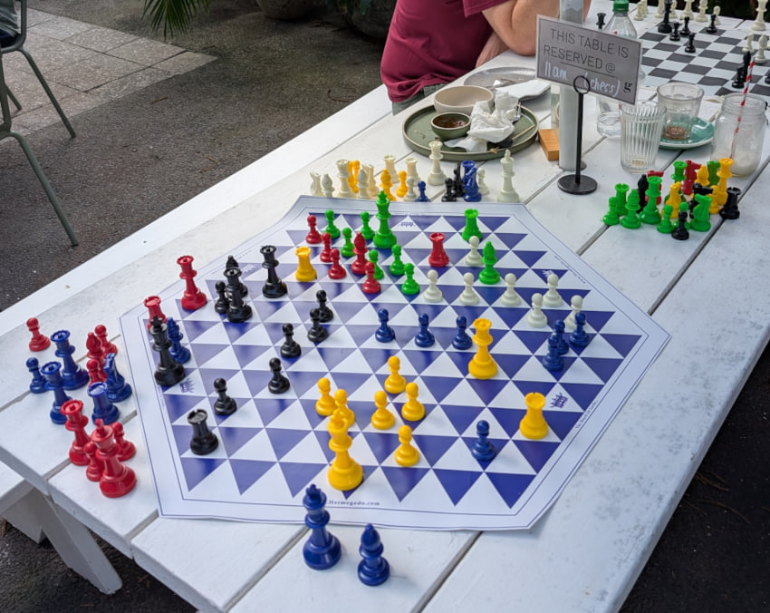

# ♟️ Brisbane Social Chess Inc.

Welcome to Brisbane's premier social chess community. We are a registered community organization in Queensland dedicated to promoting the love of chess through regular meetups and social engagement.

## 🗓️ Weekly Meetups

Join us at any of our five weekly locations across Brisbane:

| Day       | Time          | Venue                  | Location                                |
| --------- | ------------- | ---------------------- | --------------------------------------- |
| Wednesday | 12:00-2:30 PM | **June's Café**        | 17 Lytton Rd, East Brisbane QLD 4169    |
| Thursday  | 6:00-8:00 PM  | **Royal Hotel**        | 1259 Sandgate Rd, Nundah QLD 4012       |
| Friday    | 12:00-2:00 PM | **Chocolate Moments**  | 60 Albert St, Brisbane City QLD 4000    |
| Saturday  | 10:30-2:00 PM | **West End Park Café** | 305 Montague Rd, West End QLD 4101      |
| Sunday    | 11:00-2:00 PM | **The Garden Room**    | 1 Parkland Blvd, Brisbane City QLD 4000 |

## 🎯 Our Motto

> **Fun, Friendly, and Free**

## 🤝 Join Our Community

We're always looking for enthusiastic individuals to join our community! Whether you're interested in:

- Contributing to our projects and repositories
- Helping with site development
- Managing our Discord server
- Playing chess with fellow enthusiasts

After your pull request has been merged you will be invited to join the Brisbane Social Chess GitHub Organization.

## 🎉 Join Our Discord Community

Connect with other chess enthusiasts, join discussions, and participate in exclusive events by joining our Discord server!

    

Our Discord server is the best place to stay updated on upcoming meetups, online tournaments, and community activities. Everyone is welcome, from beginners to seasoned players!

## 👑 FIDE Masters Welcome

We extend a special invitation to [Master level chess players](https://en.wikipedia.org/wiki/Chess_rating_system) with official FIDE profiles. Eligible titles include:

- Super Grandmasters
- Grandmasters (GM)
- International Masters (IM)
- FIDE Masters (FM)
- Candidate Masters (CM)

**To Join**: Please verify your credentials by linking your GitHub profile to your chess.com and/or lichess profiles. Open an issue to request membership once completed.

## 👥 Management Committee

| Role            | Name                                                               |
| --------------- | ------------------------------------------------------------------ |
| President       | Jimmy Joe                                                          |
| Treasurer       | [Matt McLean](https://github.com/LuckyNotGood)                     |
| Secretary       | Steve                                                              |
| Auditor         | [Rob Garvey](https://github.com/garveybiz)                         |
| General Members | Adam Lomsargis, Ben M, [John Bampton](https://github.com/jbampton) |

## 🧑🏽‍🎨 Organizers

- Organizer
  - [Matt McLean](https://github.com/LuckyNotGood): "A good player is always lucky" - [Capablanca](https://en.wikipedia.org/wiki/Jos%C3%A9_Ra%C3%BAl_Capablanca)
- Co-organizers:
  - Adam Lomsargis: Long time chess player with a great respect and passion for the game. I believe chess offers more than just a competitive space in which to battle your opponent. It's also a great way to socialise with intelligent people and have a laugh! :D
  - Ben M: How does the horsey move again? 🤔
  - Jimmy Joe
  - [John Bampton](https://github.com/jbampton): GitHub is more about collaboration and community than code. Let me know about your favorite [chess variants](https://en.wikipedia.org/wiki/List_of_chess_variants).
  - [Rob Garvey](https://github.com/garveybiz): Welcome to Brisbane Social Chess. Come along and play with us, let us know your ideas, and help us organize future events.
  - Steve: Official pawn wrangler.
  - the Prof
- Assistant organizer
  - Roger Clarke
- Event organizers
  - Christoph Dierkes
  - JoeT
  - Marty Benjamin
  - Peiqi Sun
  - Stuart

## 🛠️ GitHub Team

### 👨‍🔧 Maintainer

- [John Bampton](https://github.com/jbampton)

### 💾 Developers

- [Max Base](https://github.com/BaseMax): Lead Developer

## 🎮 Discord Moderators

- [John Bampton](https://github.com/jbampton): Admin
- Jasper: Team Leaders
- [therealnugget](https://github.com/therealnugget): Team Leaders
- [Abhushan Gautam](https://github.com/carefreeav09)
- [Anuradha Fernando](https://github.com/anufdo)
- [Ayush Rana](https://github.com/ayushrana182)
- [Mahabub Islam Prio](https://github.com/prio101)
- [Matt McLean](https://github.com/LuckyNotGood)
- [Max Base](https://github.com/BaseMax)
- [Mohammad Lotfi Akbarabadi](https://github.com/mohammadlotfia)
- [Nicholas Meredith](https://github.com/udha)
- [Rob Garvey](https://github.com/garveybiz)
- [SM Riad](https://github.com/smriad)
- [sugiarto](https://github.com/ugifractal)

---

**Be Our First GitHub Chess Master!** Join the Brisbane Social Chess GitHub Organization today.

---

## 🎲 Games that we play

- [Chess](https://en.wikipedia.org/wiki/Chess): https://lichess.org/
  - Lots of standard two player chess sets
- [Four-player chess](https://en.wikipedia.org/wiki/Four-player_chess): https://www.chess.com/variants/4-player-chess
  - One vinyl Four-player chess set with 68 plastic pieces including 8 total queens which is packaged in a green cylindrical zipper bag
- [Harmegedo 6 Player Chess Set - The Board of Lords](https://harmegedo.com/)
  - One Harmegedo chess set with 6 armies and 108 total soldiers. Each army starts with 9 pieces (including 2 queens) and 9 pawns for a total of 18 soldiers
- [Quaternity](https://www.quaternity.com/): https://play.quaternity.com/
  - https://www.quaternity-chess.com/
  - One [Quaternity 4 Player Chess Set Basic52 144 Squares Wood Folding 64 Quality Pieces](https://www.ebay.com.au/itm/225608151106)

## 🕹️ New games recently delivered

- [Chessplus](https://www.chessplus.com/): [Everyday Edition](https://www.chessplus.com/products/chessplus-everyday-edition)
  - A fast paced, edgy version of chess with exponentially more moves & all new strategies

## ♣️ Games we might play in future

- [Go](<https://en.wikipedia.org/wiki/Go_(game)>) - at least one small Go set
- [Shogi (Japanese chess)](https://en.wikipedia.org/wiki/Shogi) - at least two Shogi sets
- [Xiangqi (Chinese chess)](https://en.wikipedia.org/wiki/Xiangqi) - at least one Xiangqi set

## 📋 Tasks to do after joining the Brisbane Social Chess GitHub Organization

Please `Star` some of our repositories ⭐ 💫 🌠 🌟

You can set your membership in the Brisbane Social Chess GitHub Organization to `Public` on the
[People](https://github.com/orgs/brisbanesocialchess/people) page when logged in.

Please show your support for your new team 🏢 🧑🏽‍💻 💃 😎 🚀

## 🏨 Royal Hotel — A Quick Game is a Good Game

## 🏡 Garden Room — Random Days Gone Bye

## 🧙‍♂️ Never Underestimate the Power of Jedi Master Big Bird

|  |  |
| :--------------------------------------------------------------------------------------------------------------------------: | :--------------------------------------------------------------------------------------------------------------------------: |

## 4️⃣ Garden Room - Quaternity Zombie Road Block

|  |  |
| ------------------------------------------------------------------- | ------------------------------------------------------------------- |
|  |  |
